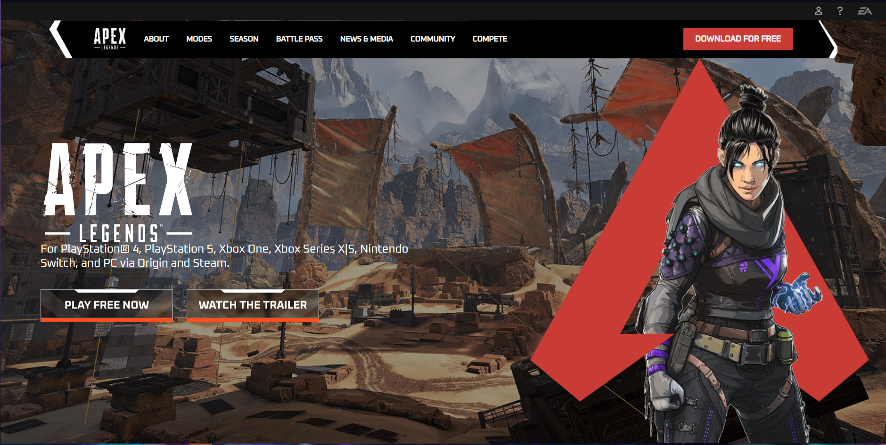

# Projeto_Site_APEX

---

## Sobre
Site do tipo landing pade para
divulgar o jogo Apex Legends.
O objetivo deste projeto é colocar 
em prática os conhecimentos, sobre
criação de site adquiridos no curso
de Desenvolvimento de Sistemas, do 
[Senai Jandira](https://jandira.sp.senai.br/).

---
## Tecnologias utilizadas
- HTML5
- CSS
- RESPONSIVIDADE
- MARKDOWN

---
## Autor
- [Luiz Gustavo](https://github.com/luizgustavo2006)

---
## Contatos
- [Instagram](https://www.instagram.com/luyz.dev/)
- [Linkedin](https://www.linkedin.com/in/luyz-dev)
- WhatsApp: (11) 9-6759-3159
